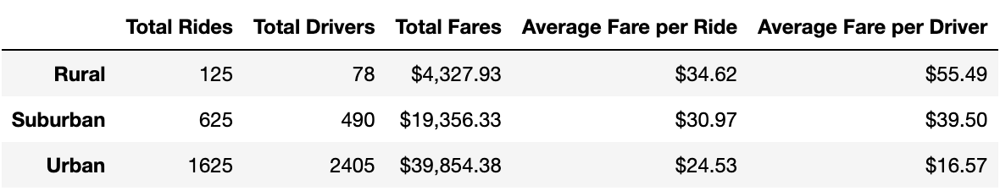
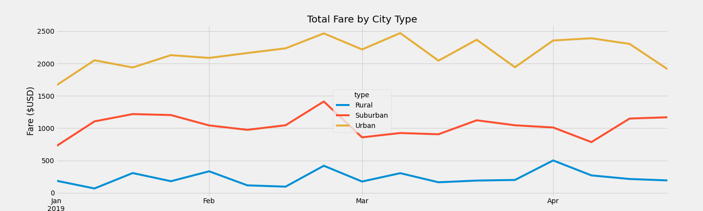

# PyBer_Analysis

## Overview

### Resources
Python 3.7.11

Data Sources: [city_data.csv](Resources/city_data.csv), [ride_data.csv](Resources/ride_data.csv)

#### Purpose
The purpose of this challenge is to analyze ride-sharing data by city type to look for trends in total rides, total drivers, total fares, average fare per ride, average fare per driver, and total fare by city type. This data will be useful when making business decisions for PyBer, the ride sharing company.

#### Process
1. Load city_data.csv and ride_data.csv into Dataframes.
2. Merge the dataframes on the "city" columns.
3. Use groupby() and sum() or count() to create a summary dataframe
4. Use groupby() to create a dataframe showing the sum of fares per city type and date
5. Reset the index then create a pivot table with the date as the index, type as the columns, and fare as the values.
6. Filter the tablet to show data from 1/1/19 to 4/28/19 then convert the date column to datetime
7. Use resample() to group the data into weeks instead of days
8. Plot the weekly fares as Total Fare by City Type

The full code is found here: [Pyber_Challenge.ipynb](PyBer_Challenge.ipynb)

## Results

#### Ride Share Summary DataFrame
The DataFrame below summarizes the Total Rides, Total Drivers, Total Fares, Average Fare per Ride, and Average Fare per Driver for three types of cities - Rural, Suburban, and Urban - from January 1, 2019 - May 8, 2019.

##### Analysis of Ride Sharing Summary Data
- Urban cities have the most Total Rides at 1625, which is 2.6 times more than Suburban cities (625 rides), and 13 times as many as Rural cities (125 rides).
- Urban cities also have the most Total Drivers, with 2405 drivers, which is 4.9 times as many as Suburban cities (490 drivers) and 30.8 times as many as Rural cities.
- Because Urban cities had the most Total Rides, it's no surprise that Urban cities also had the highest Total Fare amount at $39,854.38, which is just over 2 times that of Suburban cities (with $19,356.33 in total fares) and 9.2 times as much as Rural cities (with $4,327.93 in total fares).
- Rural cities brought in the highest average fare per ride, with each ride costing on average $34.63, which is 1.1 times more than the average Suburban city fare of $30.97 and 1.4 times higher than the average Urban fare of $24.53.
- Rural cities also brought in the highest average fare per driver with each driver earning on average $55.49 which is 1.4 times as much as Suburban city drivers, earning an average of $39.50, and 3.3 times as much as Urban city drivers, earning an average of $16.57.

#### Total Fare by City Type
The following chart illustrates the total fare for each type of city over the time period of January 1, 2019 - April 28, 2019. The Urban cities consistently bring in the most income, followed by the Suburban cities with the Rural cities bringing in the least revenue.

## Summary

- Urban cities have more Total Drivers than Total Rides during the time frame analyzed, suggesting that additional effort be put into getting more customers, and less effort be put into adding additional Drivers in the Urban cities. 
- On the other hand, Rural areas have more rides than drivers, with 1.6 rides requested for each driver (125 rides / 78 drivers), suggesting that Rural cities could see growth in both the number of drivers and riders. 
- Similarly, Suburban cities see almost 1.3 rides per driver (with 625 rides / 490 drivers) indicating that the Suburban areas could sustain more drivers in addition to more customers which could lead to more growth if the current number of drivers is a limiting factor.

#### Final Thoughts
Despite the fact that the avereage fare per ride in Urban areas is much lower than in Suburban and especially Rural areas, it's still worth putting effort in to getting more customers as long as the customer acquisition cost is not too significant. A 10% increase in rides across the board in this time period would bring in an additional $3986 for Urban cities (1625 * 0.10 * $24.53), an additional $1936 in Suburban areas (625 * 0.10 * $30.97), and an additional $432.75 in Rural areas (125 * 0.10 * $34.62).
